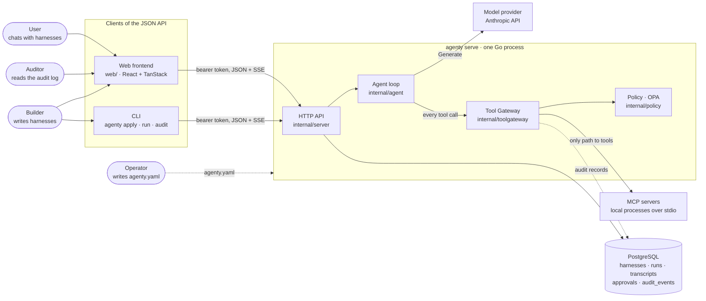
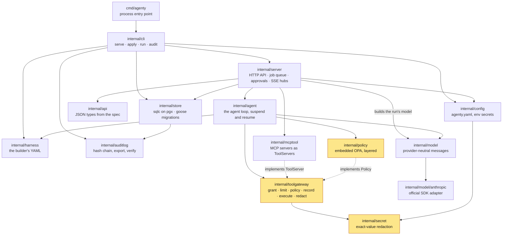
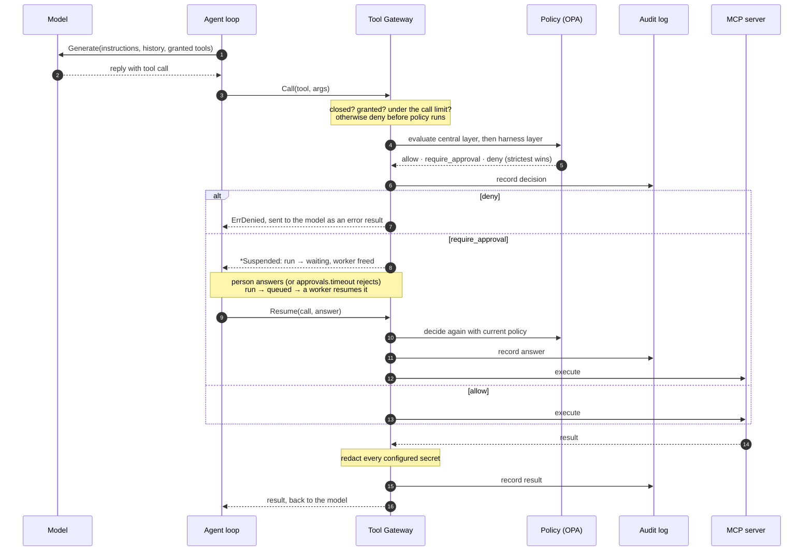
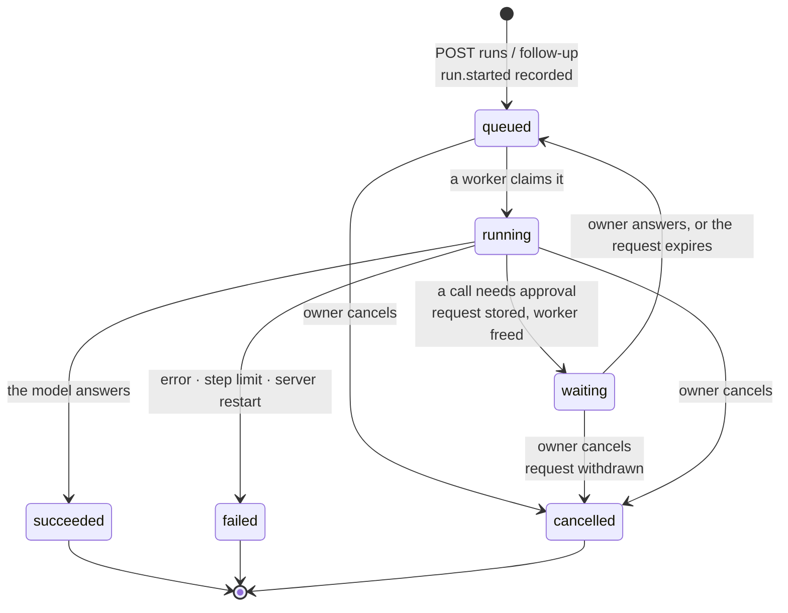
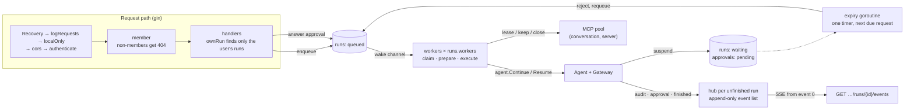
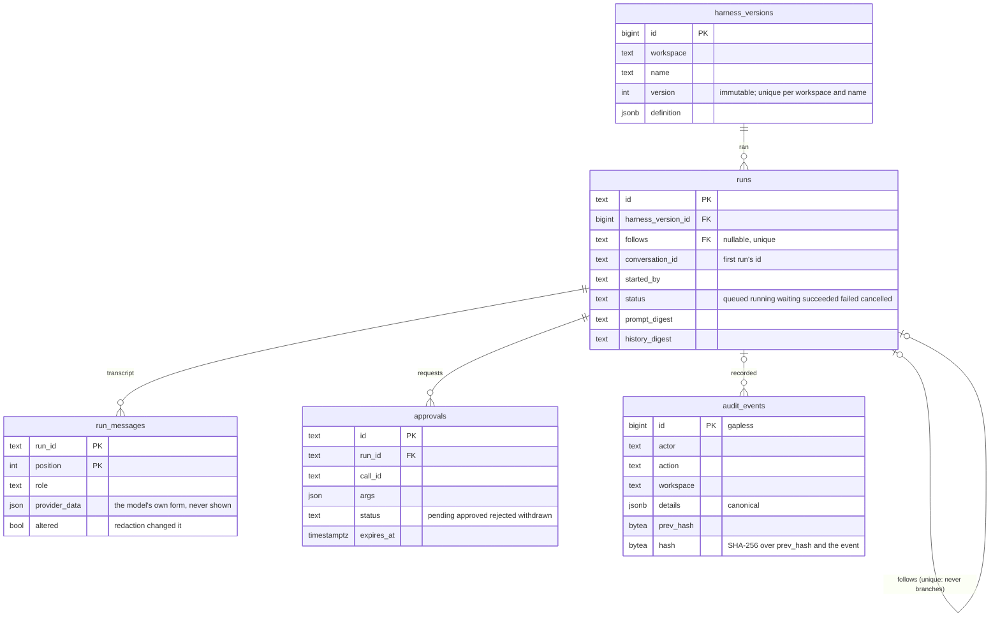
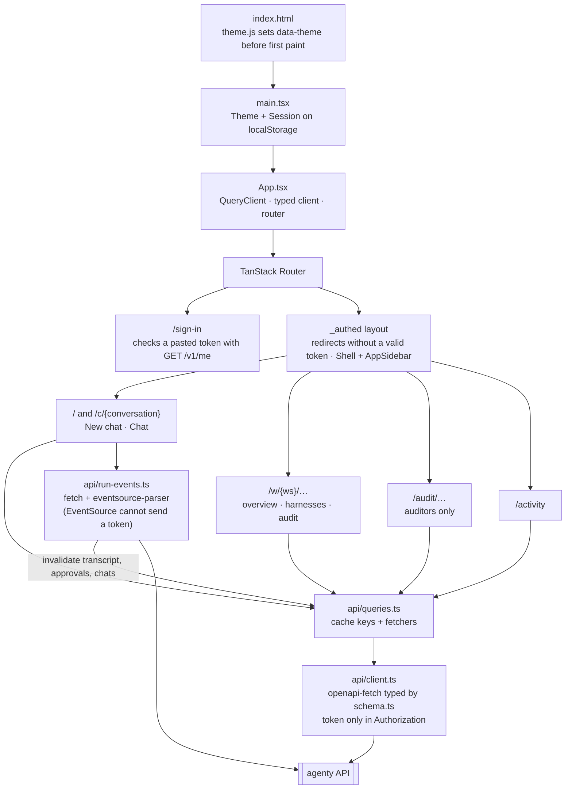

# Agenty

Agenty is an open-source, self-hostable platform for building governed AI agent harnesses. Teams define agents from building blocks the enterprise approves, and every action an agent takes is checked against policy and recorded, without the builder having to think about it. [docs/IDEA.md](docs/IDEA.md) holds the idea, the trust model and the decisions behind each stage; this page shows how the pieces fit together.

The bet is that governance can live in one deterministic place, the path every tool call takes, rather than in the model or the builder's diligence. Most of the architecture below follows from that.

## Trying it

Needs [Task](https://taskfile.dev), Docker for the database, Node.js for the example's filesystem MCP server, and `ANTHROPIC_API_KEY` in the environment or a `.env` file at the module root.

```sh
task serve     # starts PostgreSQL, builds agenty, serves the notes example
task demo      # in a second terminal: applies the notes harness and runs it
task web:dev   # the web frontend, at http://127.0.0.1:5173
```

`task check` runs what CI runs; `task --list` shows the rest.

## Architecture

### The system and its boundaries

One Go binary, `agenty serve`, holds all state in PostgreSQL and runs agents in its own process. The web frontend and the CLI are both clients of its JSON API, which `schema/openapi.yaml` defines. Two people configure it, each in their own file: the operator owns `agenty.yaml` (model provider, MCP servers, central policy, users, workspaces), and the builder owns a harness (instructions, model, granted tools, limits, harness policy). Builders never see a credential.



### Backend packages

The packages form layers, and the lint configuration enforces them: `depguard` lets only `internal/policy` import OPA, only `internal/mcptool` import the MCP SDK, only `internal/store` touch PostgreSQL and only `internal/server` use gin; `forbidigo` lets only the tool gateway call a tool, start a tool server or list its tools. A boundary that a linter checks cannot erode through one convenient shortcut.



The highlighted packages are where the trust model lives; they carry the most thorough tests and `task coverage` requires them to be fully covered. The tool gateway knows nothing of MCP, OPA or PostgreSQL: it declares the interfaces it needs (`Tool`, `ToolServer`, `Policy`, `Audit`), and every implementation sits behind the same checks.

### A tool call through the gateway

Every call the model asks for takes the same fixed path, cheapest check first. Anything short of a clear allow is a denial, and nothing runs until its decision is recorded. A call that needs approval does not block the run: the run suspends, holds no worker, and survives a restart. When a person answers, a worker resumes the run on a new gateway, whose call counts are rebuilt from the audit log, and the call is decided again under the central policy in force *then*, because an approval answers a person's question; it does not override policy.



### A run's life

The `runs` table is the job queue; there is no queue library. Workers, `runs.workers` goroutines inside `agenty serve`, claim the oldest queued run with `FOR NO KEY UPDATE SKIP LOCKED`, so they never wait for each other or take the same run. A run is never retried, as a tool may not be idempotent; a run that ends badly is continued by a follow-up instead, which tells the model how it ended.



Queued and waiting runs outlive a restart; a running one does not, and is failed by the next server's start. A follow-up starts a new run of the harness version the conversation started with, so a conversation is a chain of runs, each of which stays its own unit of audit, limits and approvals. A conversation's MCP servers stay running between its runs, kept in a pool keyed by conversation and never shared with another one.

### Inside `agenty serve`



Each unfinished run has a hub, an append-only list of its events, so a client that subscribes late still sees everything from the start; a finished run's stream is replayed from the database. The run's audit sink stores each record before it publishes it, so a client never sees an event the database does not hold.

### Data model

There are no tables for users, workspaces or conversations: users and workspaces come from the operator config, read at each start, and a conversation is the chain of runs that follow one another, named by its first run's ID.



The audit log is append-only and tamper-evident. Database triggers refuse every `UPDATE`, `DELETE` and `TRUNCATE` on `audit_events`. Appends take an advisory lock, so ids run from 1 without gaps, and each event's hash covers the one before it. A change is written in the same transaction as the events that record it. `agenty audit verify` checks an export offline and prints the anchor, the last event's id and hash, to keep outside Agenty.

### Web frontend



Route loaders and components read the same query options, so they share one cache entry. A Content-Security-Policy, written into the built `index.html`, lets the page run only its own scripts and talk only to the API. Model and tool output is always rendered as text, never as HTML: a prompt injection can shape that output, and the browser holds a token worth stealing.

### Where each guarantee lives

| Trust-model guarantee ([IDEA.md](docs/IDEA.md#trust-model-the-parts-that-matter-from-day-one)) | Enforced in |
|---|---|
| 1. The model is not trusted | the gateway's deterministic checks; nothing depends on detecting prompt injection |
| 2. Every side effect goes through the gateway | `internal/toolgateway`, with `forbidigo` and `depguard` rules in `.golangci.yml` |
| 3. Default deny | `toolgateway`: an ungranted tool is never listed, and denied before policy runs |
| 4. Strictest wins | `internal/policy`: central and harness layers evaluated apart; only `deny` and `require_approval` rules |
| 5. Credentials never reach the model | `internal/secret`, built once by `internal/config` from every `{env: …}` value; applied by the gateway, the server and the log handler |
| 6. Every tool call is recorded | `toolgateway` records before it executes; `internal/store` appends to `audit_events` |
| 7. Runs are private | `internal/server`: `ownRun` and the conversation queries find only the user's own |
| 8. Only auditors read the audit log | `internal/server/audit.go`; auditors see tool calls and decisions, never inputs or replies |
| 9. Append-only and tamper-evident | triggers in the migration; hash chain in `internal/auditlog` and `internal/store/audit.go` |

Each guarantee has a named invariant test (`TestInvariant_…`) that fails if it is broken.

## Repository layout

| Path | What it holds |
|---|---|
| `cmd/agenty` | the binary's entry point |
| `internal/` | the backend packages above; each package comment explains its role in detail |
| `schema/openapi.yaml` | the API spec, from which the Go server types and the frontend client types are generated |
| `web/` | the web frontend, its own deployable |
| `examples/notes` | an operator config, central policy and harness to try it with |
| `docs/IDEA.md` | the idea, trust model, technology choices and stage decisions |
