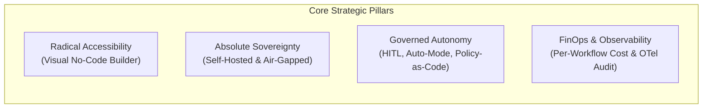
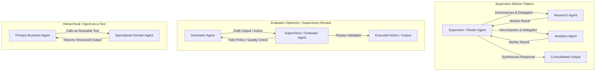

# Product Vision: Enterprise Agent Platform (Agenty)

> **Status**: Approved Vision  
> **Target Audience**: Enterprise Organizations (Cross-functional Business Teams, Engineering, Security, and FinOps)  
> **Deployment Architecture**: Infrastructure-Agnostic, 100% Self-Hosted & Air-Gapped Sovereign Deployment

---

## 1. Executive Summary & Core Philosophy

### 1.1 Vision Statement
Modern enterprises hold vast institutional knowledge, extensive APIs, and complex operational workflows, yet leveraging agentic AI has historically required specialized AI engineering teams.

**Agenty** is the **Enterprise Operating System for Autonomous Digital Coworkers**—a unified platform that empowers non-technical business domain experts to visually build, connect, and govern autonomous AI agents, while equipping technical teams with the pro-code extensibility, deterministic policy-as-code guardrails, and sovereign runtime needed to guarantee enterprise security, compliance, and cost predictability.

### 1.2 Core Pillars

- **Radical Accessibility**: Business domain experts assemble, customize, and orchestrate intelligent agents and workflows using an intuitive visual canvas without writing a single line of code.
- **Enterprise Sovereignty**: Guaranteed data privacy and compliance through a 100% self-hosted, air-gapped architecture that runs inside customer-managed infrastructure without phone-home telemetry.
- **Governed Autonomy**: Autonomy within strict, deterministic boundaries. Agents operate under pluggable policy-as-code engines, configurable human-in-the-loop checkpoints, and multi-agent supervisory oversight.
- **Model Freedom & Agnosticism**: No vendor lock-in. Seamless connection to leading commercial models, private enterprise AI gateways, or fully local, open-weight model runtimes.
- **Total Visibility & FinOps Attribution**: Every token, tool execution, and dollar spent is tracked in real-time, attributed down to specific workflows, and permanently captured in tamper-evident audit logs.

---

## 2. Target Personas & User Journeys

| Persona | Organizational Role | Core Capabilities & User Journey |
|---|---|---|
| **The Business Builder** *(Non-Technical)* | Operations, HR, Legal, Customer Support, Finance domain experts | Uses a drag-and-drop visual workflow canvas to create agents, customize instructions, link pre-approved enterprise data sources, and define notification/approval checkpoints without touching code or infrastructure. |
| **The Technical Extender** *(Developers & Engineers)* | Software Engineers, AI Engineers, Enterprise Integration teams | Authors custom tools and skills in isolated Python/TypeScript sandboxes; imports internal microservices via OpenAPI and Model Context Protocol (MCP); writes declarative policies (e.g., OPA/Rego, CEL). |
| **The Platform Admin & Compliance Officer** *(Security, IT, FinOps)* | CISO, IT Ops, Security Architects, FinOps Leads | Enforces SAML/OIDC SSO, manages hierarchical RBAC/ABAC permissions, sets per-workflow and department budget caps, audits end-to-end execution traces, and ensures zero data egress in air-gapped environments. |

---

## 3. Core Operating Model & Interaction Paradigms

### 3.1 Dual Execution Paradigms: Hybrid Operations
Enterprises require both synchronous interaction and asynchronous process automation. The platform natively supports both modes:

1. **Interactive Conversational Agents (Copilots)**:
   - Embedded into daily communication channels (Slack, Microsoft Teams, internal web portals, CRM sidebars).
   - Serves on-demand requests: Q&A over internal documents, ad-hoc task delegation, interactive drafting, and real-time guidance.
2. **Autonomous Background Workers (Digital Workers)**:
   - Headless, asynchronous execution triggered by system events, webhooks, schedules (cron), or enterprise message queues.
   - Executes long-running, multi-step business operations (e.g., vendor invoice reconciliation, security incident triaging, cross-system employee onboarding) without requiring active human presence.

### 3.2 Dynamic Autonomy Modes
Users and administrators can dynamically configure an agent's operational autonomy based on risk profile and operational context:

- **Interactive Mode**: The agent requests explicit user confirmation before executing any external tool invocation or system state change.
- **Auto-Mode (Bounded Autonomous Execution)**: Inspired by developer auto-modes, the agent executes multi-step task loops autonomously without prompting for routine read/write actions, provided they remain within the defined workspace, tool whitelist, and budget limits. It automatically drops back to interactive mode or pauses for approval upon encountering high-risk actions, policy violations, or ambiguous edge cases.
- **Background / Headless Mode**: Fully autonomous execution for scheduled or event-driven workers governed strictly by pre-defined policies and supervisory review nodes.

---

## 4. Visual Workflow Canvas & Multi-Agent Orchestration

### 4.1 The Visual Workflow Canvas
A modern drag-and-drop canvas (DAG-based) where non-technical users visually orchestrate agents, data flows, and enterprise actions:
- **Triggers**: Schedule (Cron), Webhooks, Chat Events, System Webhooks (e.g., ERP updates, ticketing triggers).
- **Agent Nodes**: Modular agent blocks configured with prompt instructions, roles, assigned models, memory contexts, and toolsets.
- **Control Flow Nodes**: Conditionals (If/Else, Switch), Loops, Parallel branches, and Data Mapping/Transformation blocks.
- **Human-in-the-Loop (HITL) Gateways**: Dedicated pause nodes requiring human sign-off via chat or portal approvals before proceeding.
- **Tool & Skill Nodes**: Direct invocation of catalog tools, API connectors, or enterprise RAG knowledge queries.

### 4.2 Native Multi-Agent Topologies
To address complex enterprise operations without brittle monolithic prompts, the platform provides out-of-the-box structural patterns for multi-agent collaboration:

- **Supervisor-Worker**: A coordinator agent decomposes complex requests into discrete subtasks, delegates them to specialized worker agents, and synthesizes the final output.
- **Evaluator-Optimizer (Supervisory Review)**: A generator agent produces proposed actions, while an independent supervisory agent validates the output against quality criteria, business logic, or compliance rules before release.
- **Agent-as-a-Tool**: Published agents can be packaged and invoked as callable tools by other agents, promoting modularity and reuse across teams.

---

## 5. Model Agnosticism, Extensibility & Knowledge Grounding

### 5.1 Model Agnosticism & Enterprise AI Gateways
The platform ensures complete independence from any single LLM vendor:
- **Broad Model Provider Ecosystem**: Out-of-the-box compatibility with major commercial LLM endpoints (Azure OpenAI, AWS Bedrock, Google Cloud Vertex AI, Anthropic, Mistral) via private enterprise endpoints.
- **Private & Air-Gapped Local Inference**: Native support for self-hosted open-weight inference runtimes (e.g., vLLM, Ollama, HuggingFace TGI) running entirely within the customer's private perimeter.
- **Enterprise AI Gateway Integration**: Seamless routing through internal corporate AI gateways (e.g., LiteLLM, Portkey, Kong AI Gateway, or proprietary proxies) respecting corporate egress, rate limits, and centralized token caching.
- **Intelligent Routing & Failover**: Per-agent model assignment with automatic failover chains during provider outages or rate limits.

### 5.2 Internal Enterprise Marketplace & Component Catalog
- **Governed Internal App Store**: Centralized registry for reusable Tools, Skills, Agent Blueprints, and Knowledge Connectors.
- **Enterprise Publishing Lifecycle**: Multi-tier visibility (team-private, department-shared, enterprise-wide) with administrative review and security validation workflows.

### 5.3 Open Integration Standards
- **Model Context Protocol (MCP)**: Native support as an MCP Client and Server for bidirectional, standard-based tool and context sharing.
- **OpenAPI / Swagger 3.x Import**: Instant conversion of existing enterprise REST/microservice APIs into validated, typed agent tools.
- **Enterprise Authentication Brokering**: Secure credential storage and injection (OAuth2 with PKCE, Service Accounts, mTLS, On-Behalf-Of user delegation).

### 5.4 Pro-Code Custom Tool & Skill Authoring
- **Isolated Sandboxed Execution**: Custom Python and TypeScript tools run inside ephemeral, resource-constrained container sandboxes with strictly whitelisted network egress.
- **Typed Schemas & Contracts**: Automated generation of LLM-friendly schemas, parameter validation, and structured error returns.

### 5.5 Enterprise Knowledge Grounding (Sovereign RAG)
- **Enterprise Connectors**: Native connectors for SharePoint, Confluence, Jira, ServiceNow, local S3/MinIO buckets, and SQL/vector databases.
- **Permission-Aware Retrieval**: Search and retrieval strictly enforce source system access control lists (ACLs)—agents never retrieve documents the querying user cannot access.
- **Verifiable Citations**: Factual assertions link directly back to verified source files with exact paragraph/page citations.

---

## 6. Governance, Policy-as-Code & Human-in-the-Loop (HITL)

### 6.1 Configurable Human-in-the-Loop (HITL)
- **Action-Level Sensitivity**: Read/query actions execute autonomously, while sensitive mutations (database updates, refunds, external emails) trigger approval checkpoints.
- **Omnichannel Approvals**: Interactive approval notifications delivered directly to **Slack**, **Microsoft Teams**, email with secure tokens, or a dedicated web-based **Approvals Inbox**.
- **SLA & Escalation Rules**: Configurable timeouts automatically route unhandled approval requests to secondary managers or initiate safe fallback procedures.

### 6.2 Pluggable Policy-as-Code Guardrails
- **Pluggable Policy Engines**: Support for declarative policy frameworks—such as **Open Policy Agent (OPA/Rego)**, **AWS Cedar**, **Common Expression Language (CEL)**—as well as custom scripted policy hooks.
- **Pre-Execution Interception**: Every agent tool call and API request is evaluated against active policy definitions before execution.
- **Non-Bypassable Hard Invariants**: Guarantees deterministic enforcement of business boundaries (e.g., transaction limits, role-based data restrictions) that LLM reasoning cannot bypass.

### 6.3 Supervisory Multi-Agent Oversight
- **Auditor Agents**: Independent supervisory agents inspect proposed actions or generated outputs for factuality, tone, and regulatory compliance.
- **Multi-Agent Consensus**: High-impact actions can require dual-agent sign-off or hybrid agent-plus-human confirmation before downstream execution.

---

## 7. Enterprise FinOps, Identity & Observability

### 7.1 Usage & Cost Monitoring with Per-Workflow Attribution
- **First-Class Per-Workflow Cost Metrics**:
  - Instant visibility into the exact financial cost of every workflow (average cost per run, p95, historical trends, and cumulative spend).
  - Step-level run breakdowns showing token counts and financial cost for every LLM invocation and tool call.
  - Per-workflow budget caps and automated shutoffs to prevent unexpected loops from draining budgets.
- **Enterprise FinOps Attribution**: Real-time tracking of token consumption and API costs mapped to cost centers, departments, workspaces, and individual agents.
- **Alerting & Export APIs**: Soft alert thresholds (e.g., 80% quota reached via Slack/email) and exportable billing data (CSV, JSON, Prometheus metrics, and automated billing export APIs for ERP integration).

### 7.2 Enterprise Identity, Access & Multitenancy
- **Enterprise SSO & IdP Federation**: Native SAML 2.0 and OIDC support (Okta, Microsoft Entra ID, Keycloak, Ping Identity) with Just-In-Time (JIT) provisioning and SCIM user synchronization.
- **Hierarchical Multitenancy**: Department and workspace segmentation ensuring complete isolation of agents, tools, credentials, and data.
- **Granular RBAC/ABAC**: Fine-grained permissions governing agent creation, execution, tool access, and administrative oversight.

### 7.3 Immutable Enterprise Audit Trails & Observability
- **Comprehensive Execution Traces**: Full lifecycle recording capturing initial prompts, reasoning steps, tool inputs/outputs, policy checks, human decisions, and final responses.
- **OpenTelemetry (OTel) Native**: Direct export of traces and metrics to enterprise observability tools (Datadog, Splunk, Dynatrace, Grafana Tempo).
- **Compliance & Tamper-Resistance**: Immutable audit logs formatted for SOC2, ISO 27001, HIPAA, and GDPR compliance audits.
- **Data Loss Prevention (DLP)**: Real-time PII/PHI detection and masking before prompts reach LLM inference runtimes.

---

## 8. Enterprise Agent Lifecycle Management (ALM) & Deployment Sovereignty

### 8.1 Enterprise Agent Lifecycle Management (ALM)
- **Interactive Simulation & Playground**:
  - Safe sandbox testing environment with mock data and read-only system replicas.
  - "Dry-Run" tool mode: simulates execution plans and visualizes downstream side-effects without mutating live systems.
- **Semantic Versioning & Instant Rollback**:
  - Immutable versioning for all agent definitions, prompts, workflows, and tool configurations.
  - Instant one-click rollback to previously verified stable releases.
- **Multi-Environment Promotion Pipelines**:
  - Formal progression across isolated tiers: **Development → Staging / UAT → Production**.
  - Mandatory promotion sign-offs from authorized team leads or compliance officers prior to production deployment.

### 8.2 Sovereign, Air-Gapped & Infrastructure-Agnostic Deployment
- **Infrastructure-Agnostic Architecture**: Packaged for reliable deployment across customer-managed environments (standard container runtimes, private cloud, or sovereign on-premises infrastructure) without vendor lock-in.
- **True Air-Gap Support**: Operates entirely offline with zero external network calls, zero phone-home telemetry, and full support for local container and model registries.
- **Absolute Data Perimeter**: Customer data, agent states, prompts, embeddings, and vector indices never leave the customer's controlled perimeter.
- **Stateless Execution & High Availability**: Scalable worker architecture decoupled from persistent state, ensuring high availability, straightforward upgrades, and reliable disaster recovery.
