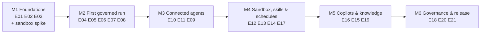

# Agenty — Roadmap

> **Status**: Draft
> **Companions**: [epics/](epics/README.md) · [CAPABILITIES.md](CAPABILITIES.md) · [ARCHITECTURE.md](ARCHITECTURE.md)

The roadmap orders the [epics](epics/README.md) into milestones. Each milestone ends in a demo that proves a usable increment, tied to the reference scenarios (VISION §9) as early as possible.

**No dates.** Velocity for a single maintainer with AI assistance is unknown. Milestones are ordered; estimates are added once M1 shows real velocity.

## Overview

| Milestone | Epics (in order) | Demo at the end | Status |
|---|---|---|---|
| M1 Foundations | E01, E02, E03, sandbox spike | `task check` passes; the server starts; the UI shell is served from the binary; spike findings recorded | Not started |
| M2 First governed run | E04, E05, E06, E07, E08 | Log in, define a harness, start it via the API, a real model runs the loop, every tool call is policy-checked, the trace is visible | Not started |
| M3 Connected agents | E10, E11, E09 | Reference scenario 1 (issue-to-change bot) through remote MCP servers, including an approval | Not started |
| M4 Sandbox, skills & schedules | E12, E13, E14, E17 | Reference scenario 2 (service request triage) with skills, scripts, and a workspace schedule | Not started |
| M5 Copilots & knowledge | E16, E15, E19 | Chat copilots, retrieval over uploads and S3 with citations, cost tracking and budgets | Not started |
| M6 Governance & release | E18, E20, E21 | Hardened audit trail, central inventory, example runs, starter kit, operator documentation, first release | Not started |

## Milestones

### M1 — Foundations

- **Epics**: [E01](epics/E01-project-foundation.md), [E02](epics/E02-server-core.md), [E03](epics/E03-web-foundation.md).
- **Sandbox spike** (throwaway, not part of E12): prove on the maintainer's setup that gVisor `runsc` works with Docker or Podman inside a Colima or Lima VM on macOS, that a stdio MCP server can be relayed over a stream, and that an egress proxy can restrict outbound traffic by hostname. Record findings; if they contradict ARCHITECTURE.md (D11, §9), record a new decision before M4.
- **Exit**: `task check` passes; `agenty` starts with migrations applied; the UI shell is served embedded and from a separate static host; spike findings recorded.

### M2 — First governed run

- **Epics**: [E04](epics/E04-identity-workspaces.md), [E05](epics/E05-harness-definitions.md), [E06](epics/E06-run-engine.md), [E07](epics/E07-agent-loop-models.md), [E08](epics/E08-toolgateway-policy.md).
- **Exit**: a user logs in, defines a harness (visually or as YAML), starts it through the API as a service account, a real model runs the loop, built-in tool calls pass through the gateway and policy, and the run's trace is visible. Invariant suites 1–5 and 7–10 pass.
- **Note**: until E09, `require_approval` decisions cannot be fulfilled; reference policies used in M2 demos only allow or deny.

### M3 — Connected agents

- **Epics**: [E10](epics/E10-connections-credentials.md), [E11](epics/E11-catalog-remote-mcp.md), [E09](epics/E09-approvals.md).
- **Why this order**: approvals become meaningful once real tools with side effects exist.
- **Exit**: reference scenario 1 runs end to end against remote MCP servers (mock or real), with credentials from the broker and an approval in the inbox. Invariant suite 6 passes.

### M4 — Sandbox, skills & schedules

- **Epics**: [E12](epics/E12-sandbox-runner.md), [E13](epics/E13-local-mcp-custom-tools.md), [E14](epics/E14-skills.md), [E17](epics/E17-schedules.md).
- **Exit**: reference scenario 2 runs end to end: a workspace schedule triggers the triage harness, skills with scripts run in the sandbox, local MCP servers and custom tools work, and closing requires approval. Invariant suite 14 passes.

### M5 — Copilots & knowledge

- **Epics**: [E16](epics/E16-chat-copilots.md), [E15](epics/E15-knowledge.md), [E19](epics/E19-observability-cost.md).
- **Exit**: a user chats with a copilot that retrieves from uploaded documents with citations; token usage and cost are visible; a budget stops a run.

### M6 — Governance & release

- **Epics**: [E18](epics/E18-audit.md), [E20](epics/E20-oversight-quality.md), [E21](epics/E21-starter-kit-release.md).
- **Exit**: audit chain verifies and erasure works; central inventory and example runs are available; both reference scenarios pass as end-to-end suites with starter-kit connectors; the no-phone-home test passes; operator documentation is complete; first release is published.

## Maintaining this roadmap

- Update a milestone's status when its first epic starts (`In progress`) and when its exit demo succeeds (`Done`).
- Reordering milestones or moving epics between them is recorded here with date and reason.
- After M1, add relative or time estimates based on observed velocity.
