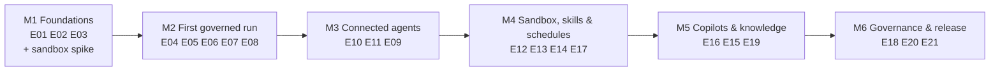

# Agenty — Roadmap

> **Status**: Draft
> **Companions**: [epics/](epics/README.md) · [CAPABILITIES.md](CAPABILITIES.md) · [ARCHITECTURE.md](ARCHITECTURE.md)

The roadmap orders the [epics](epics/README.md) into milestones. Each milestone ends in a demo that proves a usable increment, tied to the reference scenarios (VISION §9) as early as possible.

**No dates.** Velocity for a single maintainer with AI assistance is unknown. Milestones are ordered; estimates are added once M1 shows real velocity.

## Overview

| Milestone | Epics (in order) | Demo at the end (summary; see acceptance criteria) | Status |
|---|---|---|---|
| M1 Foundations | E01, E02, E03, sandbox spike | `task check` passes; the server starts; the UI shell is served from the binary; spike findings recorded | Not started |
| M2 First governed run | E04, E05, E06, E07, E08 | Log in, define a harness, start it via the API, a real model runs the loop, every tool call is policy-checked, the trace is visible | Not started |
| M3 Connected agents | E10, E11, E09 | Reference scenario 1 (issue-to-change bot) through remote MCP servers, including an approval | Not started |
| M4 Sandbox, skills & schedules | E12, E13, E14, E17 | Reference scenario 2 (service request triage) with skills, scripts, and a workspace schedule | Not started |
| M5 Copilots & knowledge | E16, E15, E19 | Chat copilots, retrieval over uploads and S3 with citations, cost tracking and budgets | Not started |
| M6 Governance & release | E18, E20, E21 | Hardened audit trail, central inventory, example runs, starter kit, operator documentation, first release | Not started |

## Milestones

### M1 — Foundations

- **Epics**: [E01](epics/E01-project-foundation.md), [E02](epics/E02-server-core.md), [E03](epics/E03-web-foundation.md).
- **Sandbox spike** (throwaway, not part of E12): prove on the maintainer's setup that gVisor `runsc` works with Docker or Podman inside a Colima or Lima VM on macOS, that a stdio MCP server can be relayed over a stream, and that an egress proxy can restrict outbound traffic by hostname. Record findings; if they contradict ARCHITECTURE.md (D11, §9), record a new decision before M4.

**Acceptance criteria**

- [ ] **AC-M1-1** — All acceptance criteria of E01, E02, and E03 are met.
- [ ] **AC-M1-2** — On a clean checkout on macOS, `task setup && task check` passes.
- [ ] **AC-M1-3** — `docker compose up` from `deploy/` starts `agenty` and PostgreSQL; `/readyz` reports ready; the UI shell loads at the root URL. Automated as `task test:milestone:M1`.
- [ ] **AC-M1-4** — The sandbox spike report in `docs/spikes/` answers, with evidence, whether (a) `runsc` works with Docker or Podman in a Colima or Lima VM, (b) stdio of an MCP server can be relayed over a stream, and (c) an egress proxy can restrict outbound traffic by hostname. Contradictions with ARCHITECTURE D11 or §9 are recorded as decisions.
- [ ] **AC-M1-5** — Invariant 13 suite passes.

### M2 — First governed run

- **Epics**: [E04](epics/E04-identity-workspaces.md), [E05](epics/E05-harness-definitions.md), [E06](epics/E06-run-engine.md), [E07](epics/E07-agent-loop-models.md), [E08](epics/E08-toolgateway-policy.md).
- **Note**: until E09, `require_approval` decisions cannot be fulfilled; reference policies used in M2 demos only allow or deny.

**Acceptance criteria**

- [ ] **AC-M2-1** — All acceptance criteria of E04 through E08 are met.
- [ ] **AC-M2-2** — Automated demo (`task test:milestone:M2`): a user logs in via Dex, creates a harness in the visual builder, a service account starts it through the API, the scripted model calls a granted built-in tool (allowed) and an ungranted tool (denied, error returned to the model), the run completes with a valid structured result, and the trace shows every step including policy decisions.
- [ ] **AC-M2-3** — The same demo runs once manually against a real model.
- [ ] **AC-M2-4** — A worker killed mid-run during the demo resumes on another worker.
- [ ] **AC-M2-5** — Invariant suites 1–5, 7–10, and 13 pass.

### M3 — Connected agents

- **Epics**: [E10](epics/E10-connections-credentials.md), [E11](epics/E11-catalog-remote-mcp.md), [E09](epics/E09-approvals.md).
- **Why this order**: approvals become meaningful once real tools with side effects exist.

**Acceptance criteria**

- [ ] **AC-M3-1** — All acceptance criteria of E09, E10, and E11 are met.
- [ ] **AC-M3-2** — Automated demo (`task test:milestone:M3`) of reference scenario 1 against mock GitLab and ServiceNow MCP servers: an automation calls the API entry point with an issue reference as a service account; the agent reads the issue; creating the change request requires approval; a workspace member approves in the inbox; the change request is created; the result matches the output contract; a comment is posted to the issue.
- [ ] **AC-M3-3** — The demo also covers rejection: the model receives the comment and the run ends without creating a change request.
- [ ] **AC-M3-4** — Invariant suites 1–10 and 13 pass.

### M4 — Sandbox, skills & schedules

- **Epics**: [E12](epics/E12-sandbox-runner.md), [E13](epics/E13-local-mcp-custom-tools.md), [E14](epics/E14-skills.md), [E17](epics/E17-schedules.md).

**Acceptance criteria**

- [ ] **AC-M4-1** — All acceptance criteria of E12, E13, E14, and E17 are met.
- [ ] **AC-M4-2** — Automated demo (`task test:milestone:M4`) of reference scenario 2: a workspace schedule fires the triage harness as a service account; the agent reads new requests; loads the taxonomy skill; runs a diagnosis script in a sandbox; categorizes requests; closing requires approval; a priority 1–2 request is never closed (denied by rule).
- [ ] **AC-M4-3** — The milestone demo passes inside a Colima or Lima VM with `runsc` (not `insecure_dev_mode`).
- [ ] **AC-M4-4** — Invariant suites 1–10, 13, and 14 pass.

### M5 — Copilots & knowledge

- **Epics**: [E16](epics/E16-chat-copilots.md), [E15](epics/E15-knowledge.md), [E19](epics/E19-observability-cost.md).

**Acceptance criteria**

- [ ] **AC-M5-1** — All acceptance criteria of E15, E16, and E19 are met.
- [ ] **AC-M5-2** — Automated demo (`task test:milestone:M5`): a user chats with a copilot that answers from uploaded documents with citations; a write action requires inline confirmation; token usage and cost appear in the FinOps view; a run exceeding its budget stops with `budget_exceeded`.
- [ ] **AC-M5-3** — Invariant suites 1–10, 13, and 14 pass.

### M6 — Governance & release

- **Epics**: [E18](epics/E18-audit.md), [E20](epics/E20-oversight-quality.md), [E21](epics/E21-starter-kit-release.md).

**Acceptance criteria**

- [ ] **AC-M6-1** — All acceptance criteria of E18, E20, and E21 are met.
- [ ] **AC-M6-2** — Automated demo (`task test:milestone:M6`): both reference scenarios pass end to end with starter-kit servers or equivalent mocks; the audit chain verifies; an erasure request makes a person's payloads unreadable; the inventory shows both harnesses and their schedules; an example run replays without side effects.
- [ ] **AC-M6-3** — All invariant suites (1–14) pass, and `task check` passes.
- [ ] **AC-M6-4** — The operator documentation has been followed successfully on a clean VM.
- [ ] **AC-M6-5** — The first release is tagged and published.

## Maintaining this roadmap

- A milestone is `Done` only when all of its acceptance criteria are checked off; each milestone demo is an automated test (`task test:milestone:Mx`) except where a criterion says otherwise.

- Update a milestone's status to `In progress` when its first epic starts.
- Reordering milestones or moving epics between them is recorded here with date and reason.
- After M1, add relative or time estimates based on observed velocity.
