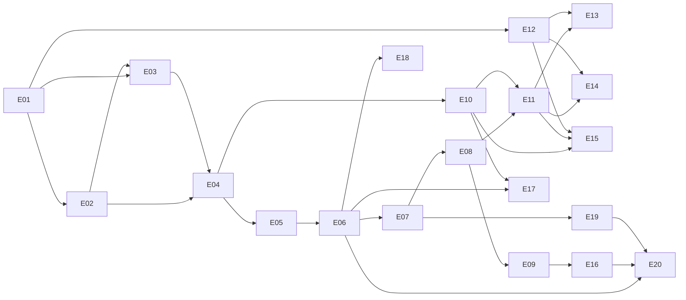

# Epics

Epics are cut by capability: each delivers a usable capability end to end (backend, API, UI, tests). E01–E03 are horizontal foundations. Every v1 row in [CAPABILITIES.md](../CAPABILITIES.md) belongs to exactly one epic. Sequencing into milestones is defined in the [roadmap](../ROADMAP.md).

**Where things live**: these files define each epic's scope and acceptance criteria. Status, acceptance-criteria progress, and stories are tracked only on GitHub: each epic is an issue labeled `epic` (E01 = #1 … E21 = #21), and stories are sub-issues labeled `story`.

| Epic | Name | Goal | Depends on |
|---|---|---|---|
| [E01](E01-project-foundation.md) | Project foundation | A repository in which every later epic can add code with tests, quality gates, and local tooling already working. | — |
| [E02](E02-server-core.md) | Server core | The shared runtime of the `agenty` server that every domain package builds on. | E01 |
| [E03](E03-web-foundation.md) | Web foundation | The single-page application shell that all UI work builds on, hostable embedded or separately. | E01, E02 |
| [E04](E04-identity-workspaces.md) | Identity & workspaces | People and automations can authenticate, and workspaces with members, roles, and service accounts exist. | E02, E03 |
| [E05](E05-harness-definitions.md) | Harness definitions | Harnesses can be defined visually or as YAML, versioned immutably, and moved through their lifecycle. | E04 |
| [E06](E06-run-engine.md) | Run engine & entry points | Harnesses can be started through the API and portal forms, run durably, and be observed. | E05 |
| [E07](E07-agent-loop-models.md) | Agent loop & models | Runs execute a real, model-driven agent loop with structured results. | E06 |
| [E08](E08-toolgateway-policy.md) | Tool Gateway & policy | Every side effect flows through one governed path with layered, non-bypassable policy. | E07 |
| [E09](E09-approvals.md) | Approvals | People approve gated actions while runs pause and resume durably. | E08 |
| [E10](E10-connections-credentials.md) | Connections & credentials | Agents call downstream systems with the correct identity's credentials, which are never exposed. | E04 |
| [E11](E11-catalog-remote-mcp.md) | Catalog & remote MCP | The enablement team publishes governed building blocks, and agents use remote MCP and OpenAPI tools. | E08, E10 |
| [E12](E12-sandbox-runner.md) | Sandbox runner | Untrusted code runs isolated on any container host. | E01 |
| [E13](E13-local-mcp-custom-tools.md) | Local MCP & custom tools | Local MCP servers and image-based custom tools run governed inside the sandbox. | E11, E12 |
| [E14](E14-skills.md) | Skills | Builders give agents expertise through skills with instructions, scripts, and resources. | E11, E12 |
| [E15](E15-knowledge.md) | Knowledge | Agents retrieve from uploaded documents and S3 with citations. | E10, E11, E12 |
| [E16](E16-chat-copilots.md) | Chat copilots | Users talk to purpose-built copilots in the web portal. | E09 |
| [E17](E17-schedules.md) | Schedules | Harnesses run on schedules, personally or on behalf of a workspace. | E06, E10 |
| [E18](E18-audit.md) | Audit | Compliance gets a tamper-evident, privacy-aware audit trail. | E06 |
| [E19](E19-observability-cost.md) | Observability & cost | Operators and FinOps see what runs do and what they cost, and budgets stop runaway runs. | E07 |
| [E20](E20-oversight-quality.md) | Oversight & quality | Central teams keep oversight, and builders gain confidence in changes. | E06, E16, E19 |
| [E21](E21-starter-kit-release.md) | Starter kit & release readiness | A fresh installation is useful on day one and can be operated with confidence. | All other epics |

## Dependencies

E21 depends on all other epics.

## Common acceptance criteria

An epic is accepted only when all of its own acceptance criteria and all of the following hold:

- All in-scope items are implemented with tests written first.
- `task check` passes locally, including coverage, mutation, architecture, and license gates (ARCHITECTURE §15.3).
- Acceptance criteria are checked off on the epic's GitHub issue only when their verification has been run and passed.
- Invariants in ARCHITECTURE §3 that the epic touches have dedicated tests.
- API changes are made in `api/` first; generated code is not hand-edited.
- New dependencies are license-checked and recorded in ARCHITECTURE §16.
- VISION.md, CAPABILITIES.md, and ARCHITECTURE.md are updated if the epic changed a decision, phase, or invariant.
- User-facing features have UI tests, including accessibility checks.

## Epic file template

Each epic file contains: GitHub issue link, milestone, dependencies, goal, capabilities covered, in scope, out of scope, references, acceptance criteria (numbered `AC-Exx-n`, each with how it is verified), optional notes, and a pointer to its stories on GitHub. Stories reference the acceptance criteria they satisfy.
